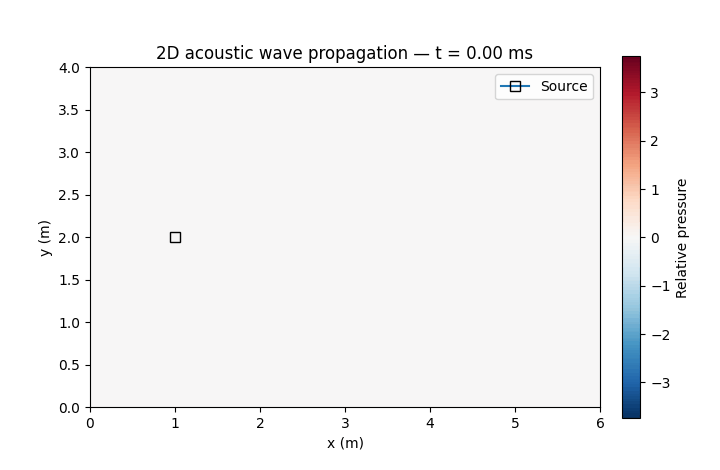
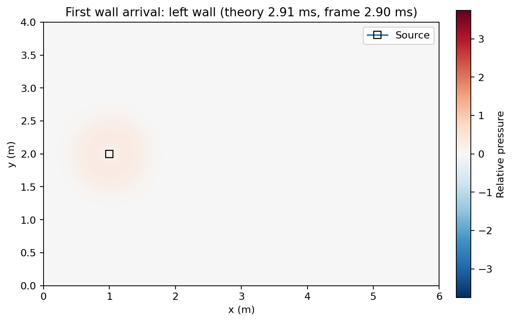

# 2D Acoustic Wave Simulation

A numerical simulation of **2D acoustic wave propagation inside a rectangular room** using the **Finite-Difference Time-Domain (FDTD)** method. The model solves the scalar wave equation with reflective Neumann boundary conditions and a localized sinusoidal Gaussian source.



## What this project demonstrates

- numerical solution of a partial differential equation (PDE)
- 2D FDTD discretization in space and time
- CFL stability control
- reflective (zero-normal-gradient) Neumann boundaries
- a spatially localized Gaussian source with sinusoidal time excitation
- theoretical source-to-wall travel-time calculations
- visualization of wave propagation and reflections

## Numerical model

The simulated field \(u(x,y,t)\) follows

$$
\frac{\partial^2 u}{\partial t^2}
=
c^2\left(\frac{\partial^2 u}{\partial x^2}+\frac{\partial^2 u}{\partial y^2}\right)
+S(x,y,t).
$$

The room boundaries use

$$
\frac{\partial u}{\partial n}=0,
$$

which represents an ideal rigid reflective boundary in this simplified model.

For unequal grid spacing, the time step is selected from the 2D CFL limit

$$
\Delta t \leq
\frac{1}{c\sqrt{1/\Delta x^2+1/\Delta y^2}}.
$$

A safety factor of `0.90` is applied.

## Default setup

| Parameter | Value |
|---|---:|
| Room size | 6 m × 4 m |
| Temperature | 20 °C |
| Sound speed | ≈ 343.2 m/s |
| Target grid spacing | ≈ 0.03 m |
| Source position | (1.0 m, 2.0 m) |
| Source frequency | 200 Hz |
| Gaussian source width | 0.06 m |
| Simulation duration | 60 ms |

The source is closest to the **left wall**, so the first theoretical wall arrival is approximately

$$
t = \frac{1.0\text{ m}}{343.2\text{ m/s}} \approx 2.91\text{ ms}.
$$

A frame close to that time is shown below.



## Project structure

```text
2d-acoustic-wave-simulation/
├── README.md
├── requirements.txt
├── .gitignore
├── assets/
│   ├── room_wave.gif
│   └── first_wall_arrival.png
├── notebooks/
│   └── acoustic_wave_simulation.ipynb
├── src/
│   └── wave_simulation.py
├── tests/
│   └── test_wave_simulation.py
└── .github/workflows/
    └── tests.yml
```

## Run the project

Create an environment and install the dependencies:

```bash
python -m venv .venv
```

Activate it, then run:

```bash
pip install -r requirements.txt
python src/wave_simulation.py
```

This regenerates the GIF and snapshot in `assets/`.

You can also open `notebooks/acoustic_wave_simulation.ipynb` for a guided version of the experiment.

Run the lightweight numerical checks with:

```bash
python -m unittest discover -s tests
```

The same checks run automatically through GitHub Actions on pushes and pull requests.

## Key findings

- The CFL-controlled time step keeps the explicit FDTD scheme numerically stable for the chosen grid.
- With a source at `(1.0 m, 2.0 m)`, the left wall is reached first, after roughly **2.91 ms** in the idealized model.
- The Neumann boundaries produce visible reflections from the room walls.
- Starting the animation at `t = 0` makes the initial propagation and first reflection directly visible instead of skipping the earliest transient.

## Limitations

This is an educational 2D scalar-wave model, not a full room-acoustics solver. The boundaries are perfectly reflective, so the model does not include frequency-dependent absorption, air attenuation, 3D geometry, obstacles, or realistic material properties.

## Technologies

Python · NumPy · Matplotlib · Pillow · Jupyter · Numerical Methods · FDTD · PDE Simulation

## Academic context

This repository is a cleaned and refactored portfolio version of a university numerical-modelling laboratory exercise. The core model and experiment were preserved, while naming, project structure, numerical robustness, reproducibility, and presentation were improved for public GitHub use.
